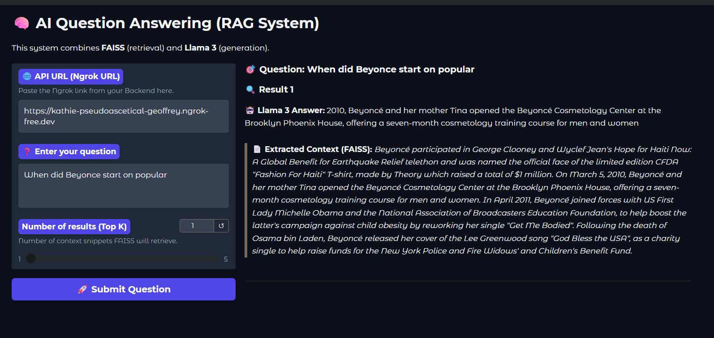

# RAG-QA System

A Question-Answering system using RAG (Retrieval-Augmented Generation) combining FAISS and Llama 3.2.

## Dataset

This project uses the SQuAD (Stanford Question Answering Dataset) and a pre-embedded version available at [MinhQuy24/SQuAD_QA_Vector_Database](https://huggingface.co/datasets/MinhQuy24/SQuAD_QA_Vector_Database) on HuggingFace. The FAISS index (`my_index.faiss`) and the embedding column (`question_embedding`) are used for efficient retrieval.

## System Architecture

The RAG-QA system consists of the following main components:

- **Embedding:** Uses DistilBERT (`distilbert-base-uncased`) to encode questions into dense vector embeddings.
- **Retriever:** Utilizes FAISS to search for the most relevant contexts from the embedded dataset.
- **QA Model:** Employs Llama 3.2 (`MinhQuy24/llama3.2_3B_SQuAD_QA`) to generate answers based on the retrieved context.
- **API:** FastAPI provides a RESTful endpoint for question answering.
- **UI:** Gradio is used to build an interactive user interface.

The pipeline works as follows:
1. The user submits a question.
2. The question is embedded using DistilBERT.
3. FAISS retrieves top relevant contexts from the vector database.
4. The QA model generates an answer using the retrieved context and the original question.
5. The answer is returned via API or UI.

## QA Model Details

- **Model:** `MinhQuy24/llama3.2_3B_SQuAD_QA` (Llama 3.2 fine-tuned on SQuAD)
- **Loading:** The model is loaded and run using the `unsloth` and `transformers` libraries, with support for 4-bit quantization for efficiency.
- **Prompting:** The model receives a prompt containing both the context and the question, and generates a concise answer.

## Project Structure

```
RAG_QA/
├── main.py              # Entry point
├── requirements.txt     # Dependencies
├── .env                 # Tokens & config
├── .gitignore
└── src/
    ├── embedding.py     # DistilBERT - embed questions
    ├── retriever.py     # FAISS - retrieve context
    ├── qa_model.py      # Llama 3.2 - generate answers
    ├── api.py           # FastAPI endpoint
    └── ui.py            # Gradio UI
```

## Setup

```bash
# Install dependencies
pip install -r requirements.txt

# Copy and edit .env (add your tokens)
cp .env .env.local
```

## Running

```bash
# Run both API + UI
python main.py

# API only
python main.py api

# UI only
python main.py ui
```

## API

```bash
# Health check
GET /health

# Ask question
POST /ask
Body: {"question": "...", "top_k": 3}
```

## Quick Test

Run `notebooks/test.ipynb` to quickly test each component:

1. **Test Embedding** - Verify DistilBERT embeddings
2. **Test Retrieval** - Search context with FAISS
3. **Test QA Model** - Generate answers
4. **Test Full Pipeline** - Complete RAG pipeline

## Test Interface

### Main UI



## Configuration (.env)

```env
NGROK_TOKEN=your_ngrok_token
HF_TOKEN=your_hf_token
API_PORT=8000
UI_PORT=7860
```